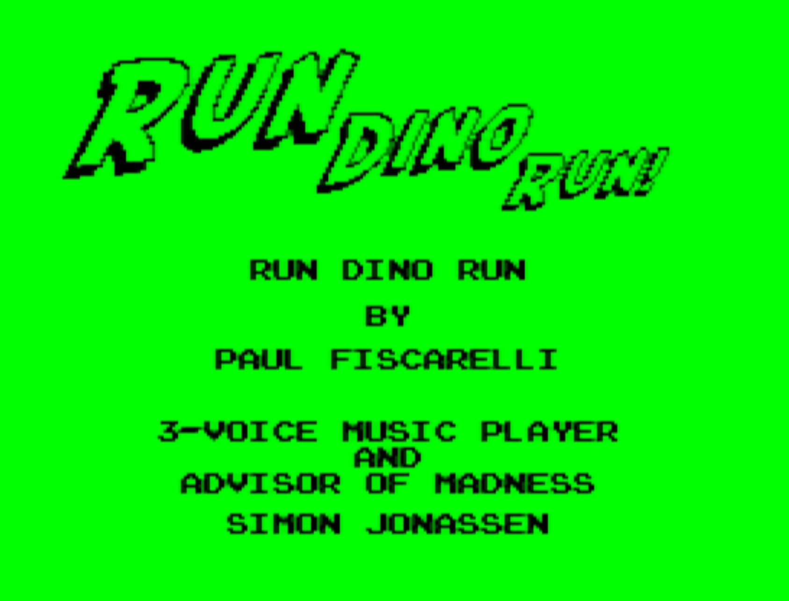
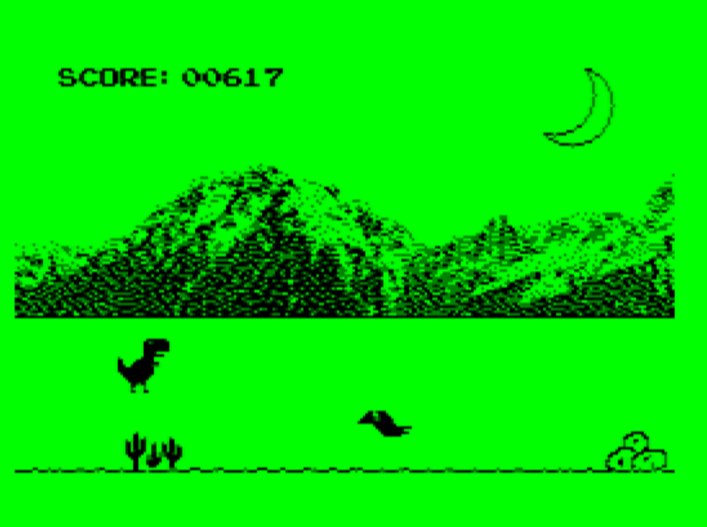

# RunDinoRun

    <table>
	    <tr>
    	    <td style="padding:5px" align="center">
        	    
      	    </td>
            <td style="padding:5px" align="center">
            	
             </td>
        </tr>
    </table>

Run Dino Run is a game for the TRS-80 Color Computer in 6809 Assembly code. It was inspired by Google's Chrome Dino game, which is an offline 'Easter Egg' within the Chrome browser - chrome://dino

The game was developed around Simon Jonassen's 3-voice saw-tooth music player. Simon had sent me copy of his synthesizer and mentioned that there was about 50% CPU (actually turned out to be about 65%) remaining for a demo or possibly a game. I decided to experiment a little to see how much could actually be done with that remaining CPU and after about 3-weeks of back-and-forth coding with Simon, this game is the end result.

One thing to keep in mind for those that may not be familiar with the TRS-80 Color Computer, there is no speciality hardware for graphics or sound - no sprites or hardware sound chip often found in similar 8-bit systems back in the 80's. This game is done all through the 6809 CPU.

The object of this 'endless runner' style game is to navigate Dino and avoid the approaching obstacles. The two available controls are "Jump" with the Spacebar or joystick button-1, and "Duck" with the Enter/Return key or joystick button-2.

The hardware requirement for the game is a TRS-80 Color Computer 3 with 128K of RAM. Despite using 'PMODE-4' graphics, the game does make use of the high-speed poke (1.79MHz) and the FIRQ interrupt for the music synthesizer.

There is an included .BIN file as well as a DSK image if you simply want to play the game with an emulator, or physical CoCo. If you want to build the game from source, there is an included batch file (assem.bat) which can be used to assemble the source code. It will require LWTools and Toolshed to create the binary file and the disk image. For additional information on how to setup the environment for building from source, take a look at the cross-assembler development environment tutorial on the Long Branch Never YouTube channnel - https://www.youtube.com/watch?v=_HlUVvypbi4

